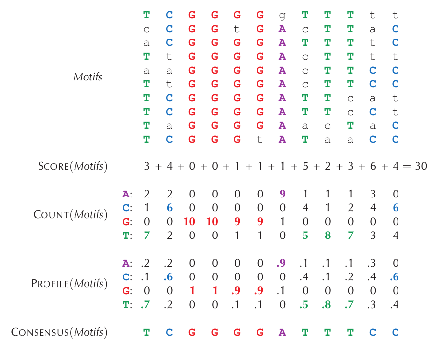
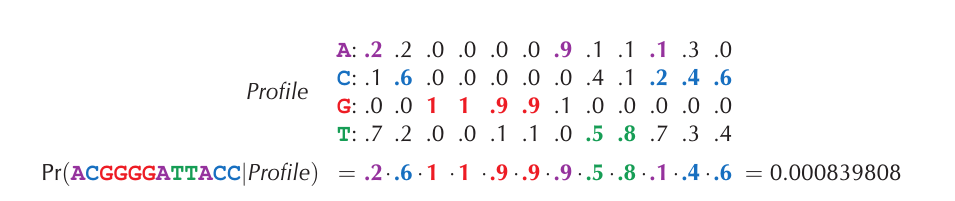
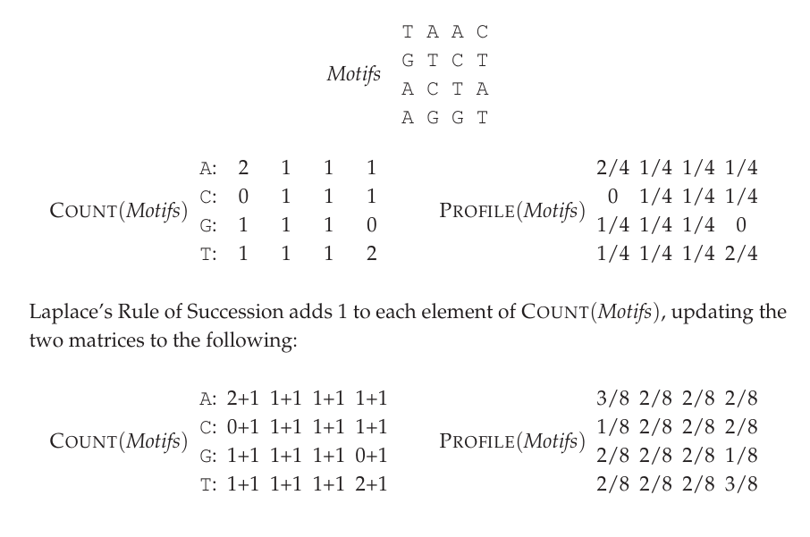
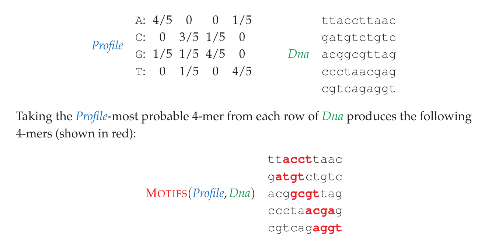

> Artikel ini adalah upaya penyelesaian masalah yang ada di buku _Bioinformatics Algorithm Vol 1_ karya Pavel Pevzner dan Phillip Compeau, spesifiknya pada _Chapter 2_ tentang _Finding Regulatory Motifs_. Semua gambar dan materi oleh karenanya berasal dari buku tersebut.

## Permasalahan Biologis: Kenapa bakteri TBC itu menyebalkan?
Bakteri tuberkulosis (_Mycobacterium tuberculosis_) adalah bakteri yang dapat menyebabkan penyakit TBC, sebuah penyakit mematikan yang pernah membuat seperempat penduduk eropa meninggal di abad ke-19. Meskipun kematian akibat bakteri ini sudah menurun signifikan akibat penemuan antibiotik, saat ini bakteri ini masih menjadi momok bagi banyak orang yang di setiap tahun dapat membunuh jutaan orang di bumi. 

Alasan kenapa bakteri ini tetap berbahaya meskipun sudah ada antibiotik adalah karena kemampuan resistensinya terhadap antibiotik. Kapasitas ini diperoleh ketika bakteri TBC beralih dari keadaan aktif menjadi dalam keadaan dorman. Dalam keadaan dorman ini, bakteri TBC tak akan menunjukan aktivitasnya di dalam tubuh (disebut **infeksi laten**) tetapi dapat bertahan di dalam tubuh selama bertahun-tahun. 

Salah satu pemicu utama yang membuat bakteri ini berubah dari keadaan aktif menjadi dorman adalah keadaan kekurangan oksigen atau _hipoksia_. Ketika bakteri kekurangan oksigen, salah satu protein faktor transkripsi bernama _DosR_ (_Dormancy Survival Regulator_) akan mengatur ekspresi banyak gen sekaligus yang membuat bakteri tersebut menjadi dalam keadaan dorman. Dalam hal ini _DosR_ perlu mengenali dan menempel pada sekuens pendek spesifik pada _upstream region_ atau promoter dari gen-gen yang diregulasinya. 

Dari pengetahuan tersebut, kita dapat membayangkan sebuah pertanyaan saintifik yang spesifik: “sekuens spesifik seperti apa di bagian promoter yang terdapat pada gen-gen tertentu yang aktif ketika proses dormasi yang dapat berikatan dengan protein _DosR_?”. Pola sekuens spesifik yang bekerja menjadi semacam sinyal untuk protein seperti _DosR_ sendiri disebut sebagai _Motif_, sehingga pertanyaan saintifik itu akan berubah menjadi _permasalahan mencari motif_. Pertanyaannya sekarang adalah bagaimana cara untuk menyelesaikan permasalahan pencarian motif tersebut?

## Penerjemahan Permasalahan Biologis menjadi Komputasional 
Permasalahan biologis tersebut mungkin saja dapat diselesaikan melalui eksperimen di laboratorium, tetapi tentu saja itu akan membutuhkan waktu dan sumber daya yang sangat banyak. Salah satu teknik modern untuk menyelesaikan permasalahan semacam ini adalah dengan menyelesaikannya secara komputasional menggunakan komputer. Namun, sebelum melakukannya, kita harus menerjemahkan permasalahan biologis tersebut ke permasalahan komputasional yang memang dapat diselesaikan oleh komputer secara algoritmis. 

Pertama-tama, perlu diketahui bahwa permasalahan komputasional haruslah memiliki _input_ dan _expected output_ yang jelas. Apabila masih terdapat ambiguitas, maka kita tak dapat membuat langkah algoritma yang dapat dimengerti oleh komputer. Untuk itu, kita perlu terlebih dahulu memformulasikan _input_ dan _expected output_-nya. 

Dalam permasalahan ini, kita telah memiliki serentetan sekuens gen yang diaktivasi oleh _DosR_ berdasarkan eksperimen penelitian sebelumnya, yang dalam artikel ini digunakan berjumlah 10. Karena protein faktor transkripsi _DosR_ berikatan di daerah promoter dekat gen, kita dapat mengekstrak sebagian sekuens pada bagian promotor di setiap 10 gen tersebut. Di kasus ini, kita akan mengambil 250bp sekuens terdekat dengan gen. Jadi, _input_ yang kita miliki adalah 10 untai DNA (direpresentasikan sebagai _string_ pada komputer) dengan masing-masing _string_ memiliki 250 huruf nukleotida.  

Selanjutnya. kita perlu menentukan _expected output_-nya. Kita tahu dari sifat yang dimiliki _DosR_, yang pasti hanya dapat berikatan pada sekuens spesifik, dan dari situ kita bisa menyimpulkan bahwa: karena 10 gen itu sudah terbukti diregulasi oleh _DosR_, maka di bagian promoter masing-masing gen tersebut akan ada sekuens spesifik dengan panjang tertentu yang mirip antar satu sama lain. Kita dapat berasumsi bahwa tentulah terjadi mutasi pada masing-masing gen, tetapi kita tetap dapat berekspektasi bahwa untuk sekuens spesifik ini, mutasinya akan minim atau terkonservasi; karena jika tidak, sekuens-nya tidak akan terkenali oleh _DosR_ yang berkontradiksi dengan fakta eksperimental kalau gen-nya diregulasi _DosR_. Atas dasar pengetahuan ini, kita dapat memformulasikan _expected output_ yang kita inginkan, yaitu dalam bentuk sekuens spesifik yang hadir di masing-masing 10 gen tadi dan huruf dari sekuens tersebut harus memiliki perbedaan seminimal mungking.

 Kita seharusnya dapat menemukan _pesan tersembunyi_ dalam bentuk _sekuens motif_ yang menjadi rahasia _DosR_ dapat mengatur semua gen tersebut! 

_Input_ dan _expected output_ kita sudah jelas. Oleh karena itu, permasalahan mencari _pesan tersembunyi_ dari 10 gen tersebut dapat dirubah menjadi permasalahan komputasional sebagai berikut: 

**Permasalahan Pencarian Motif**
> Diberikan sekumpulan $t$ untai DNA dengan panjang $n$, dan sebuah bilangan bulat $k$, temukan sekumpulan $k$-mer (satu dari setiap untai) yang meminimalkan skor perbedaan keseluruhan dari matriks motif yang dihasilkan.

**Catatan**: k-mer adalah istilah yang merujuk pada sekuens pendek DNA dengan panjang $k$ nukleotida
## Beberapa Pendekatan Algoritma 
Untuk menyelesaikan _permasalahan pencarian motif_ tersebut, kita akan mencoba tiga pendekatan, yaitu _brute force_, _heuristik_, dan _probabilistik_. Tentu saja masing-masing algoritma akan memiliki kelemahan dan kekurangannya; dan itulah yang akan kita komparasikan satu sama lain di akhir nanti. 
### Strategi Brute Force
Pada strategi pencarian paksa (_brute force_), kita pada dasarnya membuat semua produk _k-mers_ yang mungkin dari ukuran bilangan bulat _k_ yang sudah ditentukan. Kemudian dari daftar semua _k-mers_ tersebut, kita dapat mencocokan _k-mers_ tersebut dengan setiap _k-mers_ yang memang terdapat atau hadir di setiap sekuens DNA promoter, tentu saja dengan mempertimbangkan berapa banyak skor perbedaan yang ada di setiap kombinasinya. _k-mers_ yang memiliki skor paling perbedaan paling minimal nanti yang akan menjadi hasil akhir sekuens motif-nya.

Namun, pendekatan _brute force_ semacam itu sangatlah lambat, kita bisa coba perkirakan _operational cost_-nya. Ingat bahwa kita memiliki $t$ buah untai DNA dengan masing-masingnya memiliki panjang $n$. Lalu kita mencari subsekuen atau __k-mers__ dengan panjang $k$ satu per satu. Oleh karena itu, kita akan memiliki _search space_ (ruang pencarian) sebanyak $(n-k+1)^t$, dimana ekspresi $n-k+1$ itu adalah kombinasi macam _k-mers_ yang dapat dibentuk di satu untai DNA. Karena kita memiliki $t=10$, berarti kita memiliki _search space_ sekita $250^{10}$ atau setara dengan $\approx 9 \times 10^{59}$. Angka ini begitu besar dan tidak realistis untuk input data yang kita miliki. Maka dari itu, untuk strategi  _brute force_, supaya lebih realistis untuk dapat dilakukan, dilakukan pendekatan lain, yaitu `Algoritma Median String` [^1]

_Median string_ sendiri adalah  _string_ representatif (_consensus string_) yang ditentukan dari kumpulan _string_ tetapi yang meminimalisasi total skor perbedaan dari semua _string_ yang ada pada kumpulan _string_ tersebut. Nah,  pendekatan algoritma ini akan memiliki _search space_ yang jauh lebih kecil, meski tetap signifikan, dari pendekatan _brute force_ manual seperti yang direpresentasikan pada `Permasalahan Pencarian Motif` di atas. Oke, langsunglah kita coba implementasikan.   

Pertama-tama kita perlu memformulasikan skor perbedaan antar sekuens DNA secara matematis. Hal yang paling mudah untuk mengukur seberapa besar dua sekuens berbeda antar satu sama lain adalah dengan secara langsung menghitung jumlah perbedaan huruf di antara dua sekuens tersebut. Ukuran perbedaan ini disebut sebagai **hamming_distance**, yang apabila dituliskan dalam kode menjadi sebagai berikut: 

```python
def hamming_distance(seq1, seq2):
    """
    Calculates the Hamming distance between two equal-length DNA sequences.
    """
    # Hamming distance is only defined for sequences of the same length
    if len(seq1) != len(seq2):
        raise ValueError("Sequences must be of equal length.")
    
    # Zip the sequences together and count mismatches
    return sum(1 for base1, base2 in zip(seq1, seq2) if base1 != base2)
```

Kedua, kita perlu sebuah cara untuk menghasilkan semua sekuens _k-mers_ yang mungkin ada untuk sebuah bilangan bilangan _k_. Jadi untuk $k = 2$, kita akan mempunyai total $4^2=16$ macam sekuens, untuk $k=15$ berarti ada $4^{15}= 1.073.741.824$ (1 miliar) total sekuens dan seterusnya. Adapun untuk baris kode yang dapat menghasilkan _k-mers_ tersebut adalah sebagai berikut: 

```python
def generate_kmers_lazy(k, alphabet="ACGT"):
    """Yields _k-mers_ one by one without storing them in memory."""
    # itertools.product acts as a generator under the hood
    for kmer_tuple in itertools.product(alphabet, repeat=k):
        yield "".join(kmer_tuple)
```

Baris kode tersebut menghasilkan _k-mers_ tanpa menyimpannya dalam memori (makanya nama fungsinya _lazy_). Hal ini perlu dilakukan karena apabila kita membuat fungsi terpisah untuk pembuatan _k-mers_ ini dan hasilnya disimpan dalam sebuah variabel, nanti ukuran variabelnya bisa sangat besar. Akan lebih baik apabila kita mengimplementasikan fungsi ini secara langsung di algoritma utama tanpa tahapan penyimpanan di memori. Jadi ketika _k-mers_ dihasilkan fungsi ini, _k-mers_ akan langsung diproses pada tahapanan algoritma utama lebih lanjut.

Terakhir adalah algoritma utama dari `Median String` itu sendiri yang akan mencari _k-mer_ spesifik yang memiliki skor perbedaan terkecil. Langkah algoritmanya sendiri adalah sebagai berikut: 
1. menghasilkan semua _k-mers_ dari sebuah bilangan bulat _k_ 
2. dari semua _k-mers_ yang dibuat pada langkah pertama, semua kombinasi kumpulan _k-mers_ disebut matrix _motifs_, dimana dalam matriks _motifs_ tersebut akan terdapat __k-mers__ dari masing-masing sekuens DNA promoter. 
3. Dari semua kombinasi matriks _motifs_ tersebut, ditentukan mana kombinasi yang dapat meminimalkan skor total _hamming distance_ dari masing-masing __k-mers__ pada motif tersebut. 

Adapun kode untuk implementasi algoritma ini adalah sebagai berikut: 

```python
def median_string(dna_strings, k):
    """
    Finds a sequence motif in a collection of DNA strings 
    using the Median String algorithm approach.
    """ 
    
    kmer_stream = generate_kmers_lazy(k)
    consensus_kmer = ""
    consensus_motifs = []
    consensus_dist = inf  
    
    for kmer in kmer_stream:
        best_motifs = []
        best_motifs_dist = 0
        
        # For each sequence, find the window that minimizes distance to the candidate kmer
        for seq in dna_strings: 
            best_dist = inf
            best_kmer = ""
            
            # Slide a window of size k across the sequence
            for i in range(len(seq) - k + 1):
                window = seq[i : i + k]
                ham_dist = hamming_distance(kmer, window)
                
                if ham_dist < best_dist: 
                    best_kmer = window 
                    best_dist = ham_dist 
                    
            best_motifs.append(best_kmer)
            best_motifs_dist += best_dist 
        
        # Check if this candidate k-mer is the closest overall "median string"
        if best_motifs_dist < consensus_dist: 
            consensus_kmer = kmer 
            consensus_motifs = best_motifs 
            consensus_dist = best_motifs_dist
        
    return consensus_kmer, consensus_dist

```

Dari hasil akhir matriks motif terbaik yang meminimalkan total skor  _hamming distance_, ditentukan juga _consensus k-mer_ yang menjadi representasi utama dari sekuens _motif_ yang dihipotesiskan berikatan langsung dengan _DorS_. 

Dari algoritma utama yang telah dibuat, kita dapat memperkiraan _computational cost_ yang diperlukan agar komputasi algoritma ini dapat berjalan. Tak perlu berpikir panjang, kita sebenarnya sudah dapat memperkirakan bahwa _computational cost_ untuk algoriitma ini sangatlah besar, meski tak sebesar strategi _brute force_ manual yang sebelumnya. Tapi, kita dapat memperkirakannya secara lebih presisi lagi, yaitu dengan mempertimbangkan berapa banyak operasi yang dibutuhkan pada masing-masing tahapan algoritma tersebut, yang kira-kira dapat disimpulkan melalui paragraf berikut: 

Pertama, kita akan mendapati jumlah _k-mers_ yang mungkin sebanyak $4^k$. Kedua, dari semua _k-mers_ yang terbentuk, kita mencari semua kombinasi _k-mers_ yang mungkin sebanyak $t$ (dimana $t$  merujuk pada jumlah sekuens DNA promoter kita), berarti kombinasi totalnya ada $4^k \times t$. Terakhir, dari semua kombinasi tersebut, kita juga secara iteratif mencari bagian spesifik sekuens dari masing-masing DNA promoter yang memiliki kecocokan, dengan mempertimbangkan skor _hamming distance_ yang minimal terhadap motif (dimana setiap kalkulasinya memerlukan jumlah $k$ operasi), sehingga total operasi yang diperlukan adalah $4^k \times t \times n \times k$. Dengan nilai $t = 10$ dan $n=250$, maka total operasi yang diperlukan adalah $2500 \times k \times 4^k$. 

`Algoritma Median String` ini oleh karenanya memiliki _search space_ $\approx 4^k$. Jika kita hanya menghitung $k$ = 10, maka algoritma `Algoritma Median String` memiliki _search space_ $\approx 4^{10}$.Angka ini meskipun sangat besar untuk nilai $k$ besar, tetapi tidak semasif pendekatan _brute force_ manual sebelumnya yang memiliki _search space_ $\approx 5 \times 10 ^{20}$. 

Dari sini, kita dapat menyimpulkan bahwa melakukan strategi _brute force_ apapun mesti memiliki skala eksponensial untuk _operational cost_-nya. Dan untuk algoritma yang kita implementasikan, dengan besar nilai $k$ lebih dari 12 itu membutuhkan waktu yang sangat lama dan tidak memungkinkan dijalankan menggunakan laptop (saya sudah mencobanya). Oleh karena itu, di sini saya membatasi eksekusi algoritma ini hanya untuk $k<12$ (yang ini memakan sekitar 1-2 jam). 

Untuk mengeksekusinya dengan nilai $k$ yang berbeda-beda, kita tinggal membuat iterasi for loops saja: 
```python
for k in range(6,12):
	motif = median_string(dna_strings)
	print(f"k={k} | ", motif, "score: ", score)
```

Hasil dari eksekusi dari algoritma _brute force_ sendiri adalah sebagai berikut:

| k   | Motif        | Score |
| --- | ------------ | ----- |
| 6   | ACGGCG       | 5     |
| 7   | ACCGACG      | 9     |
| 8   | CATCGGCC     | 11    |
| 9   | ACCGACGGG    | 16    |
| 10  | CTATCGGCCC   | 19    |
| 11  | GGACTTCCGGC  | 20    |
| 12  | GGACTTCCGGCC | 23    |

Pada dasarnya, kita tak tahu seberapa panjang sekuens spesifik (motif) yang memang dapat dikenali oleh _DosR_ di kenyataannya. Ditambah lagi apabila kita mencermati hasil di atas, kita akan menemukan bahwa masing-masing nilai $k$, menghasilkan _consensus motif_ yang berbeda-beda. Ini memanglah membingungkan, tetapi itu sejatinya adalah hasil yang _expected_. Alasannya adalah di setiap nilai $k$, kita memiliki ruang pencarian (_search space_) yang berbeda. Dari ruang pencarian yang berbeda itu tidak ada jaminan matematis bahwa hasil  _consensus string_-nya memiliki kemiripan tinggi. Jadi bukannya algoritma _brute force_ ini tidak akurat, justru ini adalah pendekatan yang paling akurat untuk setiap nilai $k$. 

Selain itu, algoritma strategi _brute force_ juga sangat mahal secara kebutuhan komputasi. Hal ini yang menyebabkan ia jarang dipakai di dunia nyata karena praktikalitas kecepatannya yang tak memungkinkan untuk digunakan di mayoritas situasi. 

Untuk strategi lebih cepat, kita akan lanjut ke pendekatan selanjutnya: _strategi heuristik_. 

### Strategi Heuristik (Algoritma Serakah)
Jika strategi _brute force_ itu bodoh tetapi selalu akurat, maka padanan strategi yang agak lebih pintar adalah _heuristic_, yaitu sebuah strategi pendekatan jalan pintas untuk menyelesaikan masalah, meskipun terdapat harga yang harus dibayarkan, yaitu dalam bentuk akurasi yang berpotensi menurun.

Strategi heuristik yang akan digunakan di sini disebut _greedy algorithm_ (algoritma serakah). Sebagai pengantar tentang _greedy algorithm_, kita bisa membayangkan satu analogi dalam bentuk permainan catur. Dalam permainan catur, di setiap langkah kita dihadapkan banyak sekali opsi dan untuk pemula opsi mana yang tepat tidaklah selalu jelas. Namun, jika pemula itu sudah diajarkan bahwa perwira itu bernilai lebih dibandingkan pion, serta perwira satu dengan perwira jenis lain bisa memiliki nilai yang berbeda (misalnya ratu dengan benteng). Dari sini, si pemula dapat menyusun strategi untuk menentukan pilihan pada setiap langkahnya, yaitu dengan mencari gerakan apa yang memaksimalkan _reward_. Jika di suatu langkah terdapat opsi memakan peluncur, benteng, dan pion; maka si pemula akan dapat secara otomatis memakan benteng. Nah, strategi semacam ini disebut sebagai algoritma serakah karena ia memaksimalkan _reward_ di setiap tahapan langkah tanpa memperdulikan langkah sebelum dan setelahnya. 

Strategi catur itu mungkin cukup baik untuk pemula, tetapi pemain catur yang cukup cakap akan langsung mengetahui kelemahan dari strategi ini. Untuk bermain catur dengan cakap, yang diperlukan tidak hanya mempertimbangkan _reward_ terbesar di tahapan langkah saat ini, tetapi juga perlu melihat kombinasi kemungkinan yang muncul di langkah selanjutnya setelah gerakan dilakukan. Misalnya, jika musuh melakukan gerakan pengorbanan benteng untuk menyerang raja yang berpotensi skakmat, maka dengan strategi tadi si pemula akan langsung kalah. 

Analogi catur ini cukup menggambarkn _greedy algorithm_ dengan cukup baik. Pada dasarnya _greedy algorithm_ adalah pendekatan penyelesaian masalah dengan cara membangun solusi dengan memilih opsi yang memaksimalkan _reward_ pada tahapan saat ini tanpa mempertimbangkan tahapan setelah-setelahnya. Atau, dalam bahasa formal menjadi: 

> A greedy algorithm is an algorithm which, at each step, makes the choice that is locally optimal, and subsequently does not reconsider past choice. 

Apabila pemahaman ini kita terapkan terhadap `Pemasalah Pencarian Motif`, kita dapat membayangkan masalahnya menjadi permasalahan mencari _optimal k-mer_ di setiap sekuens DNA. Di masalah _DosR_, kita memiliki 10 sekuens DNA, berarti tugas _greedy algorithm_ adalah menemukan _k-mer_ optimal di setiap sekuens tersebut secara berurutan. 

Untuk mengimplementasikan _greedy algorithm_, mula-mula kita perlu terlebih dahulu mendefinisikan apa yang dimaksud dengan _optimal k-mer_. Nah, untuk mendefinisikan ini, kita memerlukan satu konsep, yaitu _motif profile matrix_ sekuens DNA. 

**_Motif Profile_**
Profil DNA didefinisikan sebagai matriks yang merepresentasikan distribusi probabilitas masing-masing nukeotida di setiap basa sekuens DNA. Sebagai ilustrasi, dapat diperhatikan gambar berikut: 



Bisa dilihat bahwa profile dihitung melalui frekuensi masing-masing jenis nukleotida di setiap posisi basa nukeotida pada kumpulan sekuens DNA. Dari profile ini kita dapat menentukan probabilitas kemunculan suatu sekuens k-mer, karena masing-masing posisi basa nukelotida sudah merepresentasikan probabilitas kemunculan masing-masing jenis nukelotida. Sebagai contoh, dapat dilihat gambar di bawah ini:



Apabila jeli, akan terlihat sebenarnya ada masalah dalam menghitung probabilitas berdasarkan profil frekuensi munrni seperti ini. Kalau saja salah satu dari posisi basa nukleotida ternyata memiliki nilai probabilitas $0$, maka probabilitas kemunculan sekuens penuh itu juga akan $0$. Memberikan nilai probabilitas 0 ke sebuah kemungkinan peristiwa, _however unlikely_, itu tidak diperbolehkan. Prinsip ini disebut sebagai _Cromwell’s Rule_, yang menyatakan bahwa kita tidak diperbolehkan memberikan kepastian (beri nilai probabilitas 0 dan 1) pada peristiwa yang sifatnya probabilistik. Oleh karena itu, kita perlu memodifikasi mekanisme pemberian probabilitas murni di atas agar nilainya tidak mungkin $0$ mutlak. Hal ini bisa ditangani dengan menggunakan _Laplace’s rule of succession_, yaitu dengan menambah nilai $1$ untuk nilai frekuensi nukelotida pada pembentukan _profile matrix_. Sebagai ilustrasi, bisa lihat contoh berikut: 


Jadi, dengan dua hal tersebut, kita bisa mendefinisikan fungsi `profile()` dengan mempertimbangkan _Laplace’s rule of succession_ dan `prob()` yang menentukan probabilitas kemunculan suatu sekuens kmer dari profile yang sudah ada.  

```python
def profile(motifs, k):
    """Generates a profile matrix using Laplace's Rule of Succession (Pseudocounts)."""
    t = len(motifs)
    # Start counts at 1.0 instead of 0.0
    profile = {nucleotide: [1.0] * k for nucleotide in ['A', 'C', 'G', 'T']}
    
    for col in range(k):
        for motif in motifs:
            nucleotide = motif[col]
            profile[nucleotide][col] += 1
            
    # Divide counts by (t + 4) because 4 virtual pseudocounts were added to each column
    for nucleotide in profile:
        for col in range(k):
            profile[nucleotide][col] /= (t + 4)

def profile_most_probable_kmer(dna_string, k, profile):
    """Finds the Profile-most probable k-mer in a single DNA string."""
    best_kmer = dna_string[0:k]
    best_prob = -1
    
    for i in range(len(dna_string) - k + 1):
        window = dna_string[i:i+k]
        prob = 1.0
        for idx, nucleotide in enumerate(window):
            prob *= profile[nucleotide][idx]
            
        if prob > best_prob:
            best_prob = prob
            best_kmer = window
            
    return best_kmer
```

#### Greedy Motif Search

Oke, memang tahapan konsep _profile matrix_ dan _profile-most-probable kmer_ tadi sangat panjang, tetapi sebenarnya apa gunanya untuk implementasi algoritma ini? Kunci untuk memahaminya adalah kita bisa menggunakan dua fungsi itu secara iteratif untuk membangun solusi _motifs_ yang kita inginkan, yaitu _motifs_ berisikan kumpulan sekuens _k-mers_ yang memiliki total skor perbedaan _hamming distance_ terkecil.

Jadi, dengan menggunakan fungsi `profile()` dan `profile_most_probable_kmer()` kita dapat menyelesaikan `Permasalahan Pencarian Motif` dengan membangun _motifs_ satu k-mer per k-mer yang diambil di setiap sekuens DNA secara berurutan. Secara lebih lengkap, tahapan kerja algoritma ini adalah sebagai berikut: 

1. Kita membuat iterasi (_outer loop_) yang bergerak untuk setiap k-mer yang ada di sekuens pertama `Dna`; _k-mers_ di sini adalah yang menjadi sekuens _motifs_ pertama (sebut saja `motifs[1]`)
2. Untuk setiap k-mer pertama itu, kita menentukan _profile matrix_ dengan _Laplace’s Rule of Succession_ tadi 
3. Profile tersebut digunakan untuk _k-mers_ `motifs[2]` melalui fungsi `profile_most_probable_kmer()`
4. Setelah `motif[2]` ditentukan, kita membangun _profile matrix_ lagi dengan menggunakan 2 sekuens sebelumnya dan _profile matrix_ ini digunakan untuk menentukan sekuens `motifs[3]` dan seterusnya
5. Langkah 2-4 dilakukan secara iteratif sampai sekuens terakhir, baru kemudian iterasi di langkah 1 berlanjut lagi untuk membangun `motifs` baru
6. Pada setiap `motifs` penuh yang telah dibuat, kita menentukan total skor perbedaan _hamming distance_. Dari skor yang disimpan, kita akan menentukan `motifs` mana yang memiliki skor minimal. 

Untuk tahapan ke-6, kita dapat membuat fungsi baru `score_motifs()` yang pada dasarnya menghitung total _hamming distance_ di setiap sekuens yang terdapat di dalamnya. Dari tahapan tersebut, kita dapat mengimplementasikannya dengan kode _python_ berikut: 

```python
def score_motifs(motifs, k):
    """Calculates the total mismatch score for a collection of motifs."""
    total_score = 0
    t = len(motifs)
    
    for col in range(k):
        # Count occurrences of each base in this specific column
        counts = {'A': 0, 'C': 0, 'G': 0, 'T': 0}
        for motif in motifs:
            counts[motif[col]] += 1
            
        # Find the maximum count (the consensus nucleotide count)
        max_count = max(counts.values())
        
        # Mismatches in this column = total strings minus the consensus count
        total_score += (t - max_count)
        
    return total_score

def greedy_motif_search(dna_strings, k, t):
    """
    Implements the Greedy Motif Search Algorithm.
    dna_strings: List of t strings of DNA
    k: Length of the motif
    t: Number of strings in dna_strings
    """
    # Initialize BestMotifs as the first k-mer from every sequence
    best_motifs = [seq[0:k] for seq in dna_strings]
    best_score = score_motifs(best_motifs, k)
    
    # Grab the first string to find all potential 'seed' _k-mers_
    first_seq = dna_strings[0]
    
    # Loop over every possible k-mer in the first sequence
    for i in range(len(first_seq) - k + 1):
        # Step A: Start a brand new candidate motif collection with our seed
        current_motifs = [first_seq[i:i+k]]
        
        # Step B: Iteratively evaluate the remaining sequences (from index 1 to t-1)
        for j in range(1, t):
            # 1. Create a profile based ONLY on the motifs collected so far
            current_profile = priofile(current_motifs, k)
            
            # 2. Find the most probable k-mer in the j-th sequence using that profile
            next_best_kmer = most_probable_kmer(dna_strings[j], k, current_profile)
            
            # 3. Add it to our growing candidate collection
            current_motifs.append(next_best_kmer)
            
        # Step C: Compare our fully built collection to our all-time best
        current_score = score_motifs(current_motifs, k)
        if current_score < best_score:
            best_score = current_score
            best_motifs = current_motifs
            
    return best_motifs
```

#### **Eksekusi dan Hasil**
Seperti sebelumnya, kita dapat menjalankan algoritma untuk beberapa nilai `k` sekaligus. Namun, karena algoritma ini terhitung cepat, akan dilakukan sampai nilai $k=20$. 

| k   | motif                | score |
| --- | -------------------- | ----- |
| 6   | CGCCGG               | 6     |
| 7   | CGGCCAG              | 9     |
| 8   | CCGGCGGG             | 12    |
| 9   | TATCGGCCC            | 17    |
| 10  | CTATCGGCCC           | 19    |
| 11  | GGACTTCCGGC          | 20    |
| 12  | GGACTTCCGGCC         | 24    |
| 13  | GGACTTCCGGCCC        | 28    |
| 14  | GGGACTTCCGGCCC       | 33    |
| 15  | GGACTTACGGCCCTA      | 35    |
| 16  | GGACTAACGACCCTAG     | 40    |
| 17  | GGGACCAACGACCCTAG    | 44    |
| 18  | GGGGACCAACGACCCTAG   | 49    |
| 19  | GGGGACCAACGACCCTAGC  | 55    |
| 20  | GGGGACCTACGTCCCTAGCC | 56    |
  
Algoritma _greedy_ ini, jika dibandingkan _brute force_ melalui `Algprotma Median String` sebeleumnya adalah langit dan bumi secara kecepatan. Bahkan, untuk menjalankan keseluruhan algoritma untuk nilai $k$ bervarisai (6-20), hanya membutuhkan sekitar 1-5 menit untuk selesai. Sangat berbeda dengan sebelumnya yang bahkan untuk menjalankan algoritma untuk $k=11$ bisa memakan waktu setengah jam lebih. 

Hal ini disebabkan karena memang _operation cost_ dari algoritma ini terhitung rendah, yang dapat kita aproksimasi dengan menghitung jumlah _search space_ yang digunakan untuk menyelesaikan algoritma ini. Pertama, algoritma serakah ini mencari setiap __k-mers__ di sekuens pertama, yang berjumlah $\approx n$, dengan $n$ adalah panjang sekuens DNA (dalam konteks data ini berarti 250bp). Kedua, dari setiap iterasi __k-mers__ dilakukan iterasi lebih lanjut untuk setiap sekuens selanjutnya (berjumlah $t$), di mana di setiap sekuens tersebut dijalankan fungsi `profle()` dan `profile_most_probable_kmer()` yang memiliki _operation cost_ sekitar $k$ dan $n \times k$ secara berurutan. Menggabungkan semuanya kita dapat mengestimasi bahwa _operation cost_ keseluruhan algoritma ini hanyalah $n \times k^2 \times t$, yang jauh lebih kecil dibandingkan sebelumnya yang memerlukan $4^k$.    

Meskipun cepat, kita dapat melihat sedikit penurunan akurasi dari hasil _consensus motif_ yang dihasilkan dari algoritma ini, yaitu melalui peningkatan skor total perbedaan _hamming distance_ secara konsisten dibandingkan dengan algoritma `Median String` sebelumnya. Kelemahan lain yang cukup signifikan dari algoritma ini adalah ketergantungan besarnya terhadap __k-mers__ yang digunakan sebagai _seed_ di sekuens pertama, yang digunakan untuk membuat _profile matrix_ pertama kalinya. Jika saja kita memiliki dataset berjumlah banyak sekuens, tapi kebetulan sekuens pertama dalam dataset tidak mengandung motif yang kita cari, maka dengan menggunakan algoritma ini kita tak akan pernah mendapatkan kumpulan _motifs_ yang kita inginkan.   

Terlepas dari itu, _greedy algorithm_ tetaplah menjadi salah satu _tools_ dalam arsenal peneliti _computational biology_ karena efisiensi komputasinya membuat algoritma ini dapat diaplikasikan untuk data yang besar.
### Strategi Probabilistik (Algoritma Monte Carlo)
Jika _brute force_ terlalu lambat, tetapi _heuristic_ terlalu serakah dan bodoh, Bisakah kita mendapatkan _the best of both world_? Jawabannya adalah iya, meskipun tidak sepenuhnya. Hal ini dilakukan dengan menggunakan pendekatan yang sepenuhnya berbeda dari sebelum-sebelumnya, yaitu dengan memanfaatkan _randomness_ atau keacakan. Memang aneh kalau dipikirkan secara sekilas. Bagaimana algoritma yang bergantung pada keacakan bisa menghasilkan solusi terhadap permasalahan. Tapi memang begitulah kenyataannya; banyak benda di alam semesta (bintang, kehidupan, dll) ini pun juga bisa dipikirkan sebagai keteraturan yang muncul dari kecenderungan alam semesta untuk menuju ke ketidakteraturan (_entropy_), yang dengan kata lain ada pergerakan dari keacakan menjadi ketidakacakan, _but I digress_. 

#### **Randomized Motif Search**

Kembali ke topik utama, bagaimana algoritma probabilstik ini bekerja? Ingat sebelumnya kita memiliki fungsi `profile(motifs)` yang dapat menghasilkan _profile matrix_ dari _motifs_ (sekumpulan sekuens _k-mers_). Sekarang, dari kumpulan _strings_ sekuen `Dna` dan sebuah _profile matrix_, kita akan mendefinisikan fungsi `motifs(profile, Dna)` yang akan menghasilkan kumpulan k-mers yang masing-masingnya berasal dari hasil fungsi `profile_most_probable_kmer()` yang dijalankan pada setiap sekuen DNA. Sebagai ilustrasi, bisa di lihat pada gambar berikut. 



Nah, kunci dari algoritma ini adalah dengan secara terus-menerus mengulang proses pembentukan motifs menggunakan fungsi`motifs()`dan mengupdate _profile matrix_ di setiap _motifs_ yang terbentuk pada setiap iterasi. Dengan kata lain, kita terus mengiterasi rentetan fungsi berikut: 
$$Profile(Motifs(Profile(Motifs(Profile(Motifs),Dna))))...$$
Iterasi secara terus menerus dilakukan selama skor total perbedaan _hamming distance_ dari _motifs_ yang terbentuk terus menurun (kualitas _motifs_-nya meningkat terus). Jadi, secara kasar kita dapat menuliskan algoritmanya menjadi beberapa tahapan berikut: 
1. membuat _motifs_ awal dengan secara acak memilih _k-mers_ pada setiap sekuen DNA sebagai langkah inisiasi
2. membuat _while loop_ yang akan terus berjalan untuk membuat _profile matrix_ menggunakan fungsi `profile(motifs)` terhadap _motifs_ yang dibuat di iterasi sebelumnya dan membentuk _motifs_ baru dengan menjalankan fungsi `motifs`
3. langkah iterasi di tahapan 2 berjalan secara terus menerus kecuali sampai pada kondisi dimana skor _hamming distance_ yang dihasilkan pada iterasi terakhir lebih kecil daripada yang dihasilkan pada iterasi sebelunya.

Tahapan algoritma ini apabila diimplementasikan dalam kode _python_ akan terlihat demikian: 
```python
import random

def randomized_motif_search(dna_strings, k, t):
    """
    Runs one instance of the Randomized Motif Search algorithm.
    """
    # 1. Randomly select initial motifs uniformly
    motifs = []
    for dna in dna_strings:
        random_idx = random.randint(0, len(dna) - k)
        motifs.append(dna[random_idx : random_idx + k])
        
    best_motifs = motifs
    
    while True:
        # 2. Build profile with pseudocounts from current motifs
        profile = profile(motifs)
        
        # 3. Form new motifs by finding the Profile-most Probable k-mer in each string
        motifs = [profile_most_probable_kmer(dna, k, profile) for dna in dna_strings]
        
        # 4. Compare scores
        if score(motifs) < score_motifs(best_motifs):
            best_motifs = motifs
        else:
            return best_motifs


def repeated_randomized_motif_search(dna_strings, k, t, iterations=1000):
    """
    Runs RandomizedMotifSearch multiple times to avoid local optima
    and returns the best motifs found across all runs.
    """
    # 1. Run the algorithm once to establish a baseline "best"
    best_motifs = randomized_motif_search(dna_strings, k, t)
    best_score = score_motifs(best_motifs)
    
    # 2. Run the algorithm 999 more times
    for i in range(1, iterations):
        # Get the final motifs from a fresh random start
        current_motifs = randomized_motif_search(dna_strings, k, t)
        current_score = score_motifs(current_motifs)
        
        # 3. Compare with our all-time best
        if current_score < best_score:
            best_motifs = current_motifs
            best_score = current_score
            
    return best_motifs
```

Memang, apabila kita menjalakan algoritma ini satu kali, kita kemungkinan besar akan mendapatkan hasil yang buruk. Tapi, jika kita menjalankan algoritma ini sebanyak 1000 kali atau lebih dan menyimpan _motifs_ yang memiliki skor terbaik, maka dapat dipastikan kita akan mendapatkan hasil yang cukup baik. 

#### **Hasil Randomized Algorithm**

Setelah menjalankan algoritma untuk mencari motif dengan $k=20$ ini sebanyak 1000 kali, didapatkan hasil berikut:


| K   | Sequence             | Score |
| --- | -------------------- | ----- |
| 6   | ACGGCG               | 5     |
| 7   | CTTCGGC              | 9     |
| 8   | CTTCGGCC             | 11    |
| 9   | GGCGGGGAC            | 16    |
| 10  | ATCGACCCCA           | 19    |
| 11  | GACCATCGGCC          | 20    |
| 12  | GACCTACGGCCC         | 24    |
| 13  | GGACCTACGGCCC        | 28    |
| 14  | GGACTTACGGCCCT       | 31    |
| 15  | GGACTAACGGCCCTA      | 35    |
| 16  | CGGGACCTACGTCCCT     | 39    |
| 17  | CGGGACCTACGTCCCTA    | 43    |
| 18  | GGGACCTACGTCCCTAGC   | 46    |
| 19  | GGGACCTACGGCCCTAGCC  | 50    |
| 20  | CGGGACCTACGTCCCTAGCC | 55    |


Hasil dari _Randomized Algorithm_ di atas memiliki skor yang konsisten lebih baik (lebih rendah) dibandingkan hasil _greedy algorithm_, meskipun untuk waktu eksekusinya lebih lambat. Tetapi, apabila sedikit jeli, akan terlihat di beberapa hasil, _Randomized Algorithm_ memiliki nilai skor lebih tinggi. Hal ini tak terhindarkan karena memang _nature_ dari algoritma ini yang probabilistik, sehingga hasil _running_ bisa berbeda-beda; hasilnya seringkali lebih baik daripada _greedy algorithm_ tetapi terkadang tidak. Namun, keuntungan dari algoritma ini adalah kita bisa membuat hasilnya memiliki skor lebih rendah lagi apabila kita melakukan iterasi lebih banyak lagi, misalkan 10000; meskipun dengan catatan bahwa waktu eksekusinya akan lebih lambat lagi.

Jika dibandingkan dengan _Median String_, memang algoritma ini kalah secara akurasi. Namun, sebenarnya bedanya tidak jauh dan kecepatan algoritma ini jauh lebih cepat dan bisa dijalankan untuk nilai $k$ yang besar sekaligus. Oleh karena itu, pendekatan algoritma ini sangat _versatile_ untuk berbagai macam kasus permasalahan pencarian motif. 
## Komparasi Hasil dari Berbagai Algoritma dan Sekuens Motif Sebenarnya

Setelah kita jalankan ketiga algoritma yang dibuat, tahapan terakhir adalah membandingkan dengan sekuens motif _binding site_ dari _DosR_ yang sebenarnya. Kita dapat mendapatkan sekuens _motif_ sebenarnya dari hasil penelitian dan eksperimen sebelumnya, salah satunya dari paper berikut: [Park et al. (2007)](https://pmc.ncbi.nlm.nih.gov/articles/PMC1992516/#:~:text=Together%2C%20these%20results%20demonstrate%20that,tuberculosis). Dalam eksperimen tersebut, sekuen motifnya adalah sekuen 20bp dalam bentuk palindrom[^2] `5' TTSGGGACTWWAGTCCCSAA 3'` (dengan W=C/G dan S=A/T). Namun, untuk mensimplifikasinya, sekuens _binding site_ yang akan dipergunakan adalah sekuen 15bp: `GGGACTTTGGGTACT`; dengan mengambil bagian inti sekuen yang terkonservasi. Sekuen ini yang juga digunakan dalam buku _Bioinformatics Algorithm_ dan juga akan digunakan sebagai _ground truth_ dalam artikel ini. Tentu saja, untuk mengkomparasikan dengan hasil algoritma, kita akan memilih hasil dari nilai $k$ yang sesuai dengan panjang sekuen sebenarnya tersebut, yaitu 15. Namun, karena hasil _Median String_ tidak sampai $k=15$, maka kita akan menggunakan yang nilai $k=12$ karena itu yang terbesar. 

**Perbandingan Hasil**

Jika hasil motif dari masing-masing algoritma dikomparasikan dengan sekuen target 15bp tadi, kita akan mendapatkan _alignment_ sebagai berikut. 

| Algorithm                                  | Motif Alignment                                              | Overlap Similarity         |
| ------------------------------------------ | ------------------------------------------------------------ | -------------------------- |
| _Brute Force_<br>**(Median String)**             | `GGGACTTTGGGTACT`<br>`-llllll--ll--`<br>`-GGACTTCCGGCC`      | 72.73% <br>(8/11 matches)  |
| _Heuristic_ <br>**(Greedy Motif Search)**        | `GGGACTTTGGGTACT`<br>`-llll----l---l`<br>`-GGACCGAAGTCCCCG`  | 42.86%<br>(6/14 matches)   |
| _Probabilistic_<br>**(Randomized Motif Search)** | `GGGACTTTGGGTACT`<br>`-llllll--ll--ll`<br>`-GGACTTACGGCCCTA` | 71.43% <br>(10/14 matches) |

Dari hasil tersebut, kita dapat mengetahui bahwa strategi _brute force_ memang yang terbaik karena algoritma ini menjamin mendapatkan kumpulan _k-mer_ yang memiliki total skor perbedaan terkecil. Di sisi lain, strategi _heuristic_ melalui _Greedy Motif Search_ gagal total. Hal ini disebabkan karena sekuens bakteri TBC sendiri memiliki karakteristik unik, yaitu nilai _GC-content_-nya yang sangat tinggi, spesifiknya $\approx 65\%$. Alhasil, algoritma _greedy_ yang mengambil opsi dengan _reward_ lokal maksimal di awal dan algoritmanya juga tidak mempertimbangkan informasi di langkah sebelumnya, membuat ia mudah terjebak dalam _local optimum_ yang salah. Dalam hal ini, _local optimum_ yang salah adalah daerah dengan rentetan G-C panjang. 

Di sisi lain, hasil _Randomized Motif Search_ mendekati akurasi dari _brute force_, dan dengan tambahan kelebihan komputasinya yang efisien. Hal ini disebabkan karena algoritma ini melakukan strategi yang memanfaatkan probabilitas dan dilakukan dalam pengulangan/iterasi yang banyak. Kita bisa membayangkan bahwa dari 250bp masing-masing sekuens DNA, mayoritas darinya memang _noise_, tetapi terdapat daerah tertentu yang memang penuh _signal_ (ditandai dengan _profile matrix_ yang berbeda karakter dengan _noise background_). Sebagian besar dari 1.000 _running_ tersebut memang akan terjebak di zona kaya G-C yang salah. Namun, karena posisi awal diacak, ada beberapa _running_ beruntung yang jendela awalnya tepat jatuh di atas sekuens DosR yang asli. Sekali matriks probabilitas (Profile) menyentuh sinyal DosR asli, ia bertindak seperti magnet yang menarik sekuens dari baris-baris lain keluar dari jebakan _background noise_.

## Konklusi 
Dari keseluruhan pembahasan yang telah dibuat, dapat disimpulkan bahwa permasalahan biologis dapat diselesaikan secara komputasional, tetapi dengan catatan bahwa permasalahan biologis tersebut harus dapat direpresentasikan dengan baik dalam komputer. Algoritma komputer yang tak mengetahui apa-apa tentang pengetahuan protein, gen, atau bakteri, secara independen dapat mendeteksi keberadaan _pesan rahasia_ yang memiliki nilai informasi tinggi, seperti pada kasus pencarian motif ini. 

[^1]: Untuk pembuktian kenapa algoritma Median String bisa ekuivalen dengan pendekatan algoritma awal (pencocokan _k-mers_ di setiap sekuens satu per satu), bisa langsung saja lihat di buku Bioinformatics Algorithm halaman 79-82. 

[^2]: Palindrom adalah istilah untuk menyebut sekuen yang apabila dibaca dari depan atau belakang menghasilkan sekuen yang sama. Contohnya: “ATCCTA” jika dibalik “ATCCTA”.
