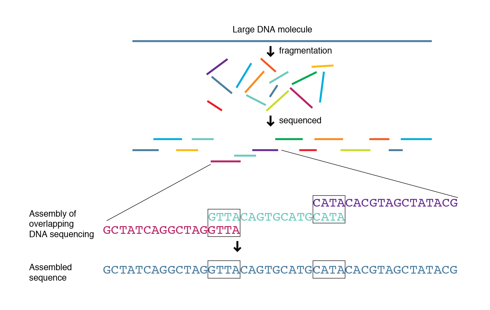
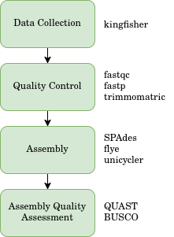
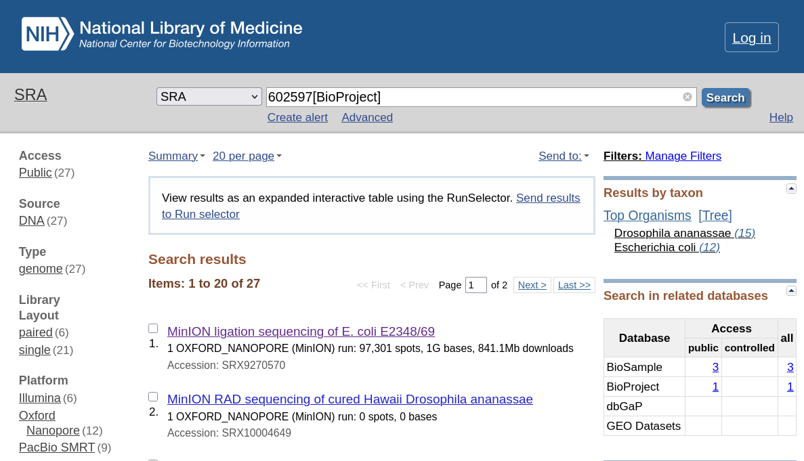
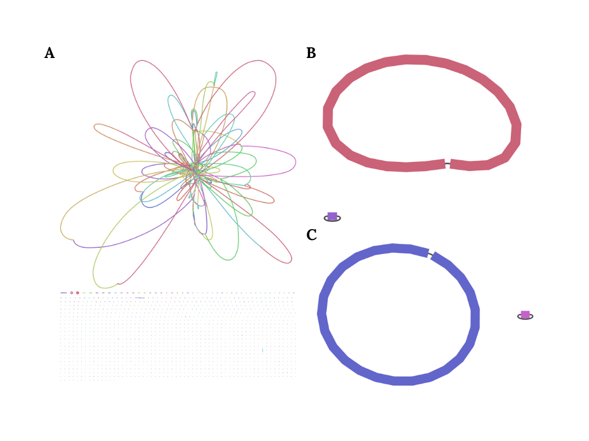

# Exploring De Novo Bacterial Assembly: Comparing Short-Read and Long-Read Assembly

Genome assembly is the complete reconstruction of an organism's genome using sequence reads generated by sequencing machine. It is very important in life science because a genome is the complete genetic code, or a blueprint if you will, of an organism. By acquiring an organism's genome, scientist can collect all the genes that are contained within the organism and therefore develop hypothesis or even a model that can predict the behavior or activity of the organism under different conditions.

However, acquiring genome is hard for many reasons. The first problem is related to the sequencing technology used to get the data. DNA is small and somewhat fragile molecule; and genome contain millions or even billions of information in the form of nucleotide base. One cannot simply expect that sequencing technology would generate an entire genetic code within an organism fully intact with no error. The current sequencing technology that can produce the amount of data needed to acquire organism's genome are mainly dominated by three companies: Illumina, Pacific Bioscience (PacBio), and Oxford Nanopore
Technologies (ONT). Those three companies develop sequencing machine that capable of producing high-throughput data using different methodologies. The differences in method and technology used to read the sequence data from the DNA sample are what causes those three machines to produce datasets with different characteristics.

I will not discuss the technicalities of each technology as it is beyond the scope of my knowledge, but instead I will mostly explore and compare the sequence dataset produced by each machine in the context of producing de novo genome assembly. But, before I do anything else, firstly I will discuss about the problem of genome assembly.

## The Problem of Genome Assembly

Usually the dataset that came from sequencing machine usually are fragmented, where each fragment is called a sequence read. It is especially so for for the dataset that came from Illumina machine. For illumina machine to be able to read the sequence data, the DNA need to be cut into pieces and millions of DNA fragments are read in parallel. Therefore, the dataset produced by illumina contains millions of sequence reads, where each read has the size of approximately 300 bp. Therefore, the illumina dataset is usually called short reads. I think we can imagine here that in order to get the entire genome from this dataset, we need to connect each of the read appropriately and correctly so that we get the full genome sequence completely intact. It is like solving jigsaw puzzle, except there are millions of pieces. This require sophisticated method and significant amount of computational cost, especially for complex eukaryotic organism (which I don't even dare to try because I only have access to an old ThinkPad laptop that was released almost 12 years ago as my compute machine).



However, the limitation of Illumina sequencing machines were somewhat solved by the other two companies, PacBio and ONT, who are capable of producing high-throughput sequence data without the need of cutting the DNA to pieces. The datasets that came from these machines are called long-reads sequence precisely because the sequence data are very long, 10000-50000 bp (10kb to 50kb); with a special advanced technique one can even get 100kb long sequence read. So, using this technologies the amount of jigsaws pieces are significantly reduced. However, there is another problem: the accuracy of the reads are significantly worse than short-reads produced by illumina. Using the jigsaw analogy earlier, it can be thought that now the jigsaw pieces are not accurate and therefore sometime the inaccuracies result in unresolvable puzzle.

## The General Plan

Now that I have introduced the problem of genome assembly, I will talk about the general plan of this article. What I will do in this article is trying to learn and understand the different characteristics of short-reads produced by Illumina and long-reads produced by Nanopore Technology and PacBio sequencing machines. I would then compare the quality of the assembly result from each dataset to answer a specific question: among the three platforms, which is the best at producing genome assembly? What is the best strategy to produce the best genome assembly? Is it by using short-reads or is it by using long-reads? or is it something else entirely?

Obviously, along the way, of course I will discuss the use of various tools used for performing genome assembly. As for the use of tools/programs, I will mostly use `conda`, in particular [`miniforge`](https://github.com/conda-forge/miniforge), to create isolated analysis environments and install the needed tools within those environments.

The general workflow consist of few steps. It can be summarized as follow:


## Dataset Collection

Okey let's start implementing the first step of the work flow, that is data collection. Here, I need to clarify that all the used data are acquired through public database, and I do not generate the data myself. Since the goal of this exploration is comparing the assembly result from different sequencing platform, I need to find sequence dataset that are acquired using those three different machines. But to make the comparion fair, the dataset need to came from the same organism and the same DNA sample, but are acquired using those three different machine. Luckily, there is such dataset that came from [this paper](). The dataset can be accessed from NCBI with the identity **BioProject 602597**.

There are several methods you can do to collect sequence dataset. You can directly download the dataset from the NCBI website. To do that, firstly ypu need to go to the NCBI website and search for the BioProject 602597. After you click the link, you will be directed to the page that contain the information about the project, including the list of datasets that are contained within the project. The dataset are categorized according to the sequencing platform used to acquire the data, which are Illumina, Nanopore, and PacBio. What you need from that website is the list of accession number for each dataset, specifically the SRA (Sequence Read Archive) accession number.



If you click to one of the link above, you can see the SRR accession number. That's what we need and we need to store every accession number that we want to use. In this article, I use the following dataset:

```
SRR Accession Number
    Illumina dataset : SRR11434958
    Nanopore dataset : SRR12801740
    PacBio dataset   : SRR14434960
```

The rationale for choosing those dataset is that they are deep enough to perform genome assembly, and they are also not too big so that I can process them in my old laptop machine. The size of the dataset is around 10-20 Gb, which is still manageable for my machine.

Also, one thing to note is that the NCBI only stores the sequence reads in SRA (sequence read archive) format (the file extension would be `.sra`). However, in most data processing and analysis, what you would want is a sequence data in the form of `fastq` file. So a conversion from `sra` to `fastq` file is needed here before we can do anything to the dataset. We can do this using several means. The first way is to use the SRA toolkit provided by the NCBI itself, which is a command-line tool that can process the `sra` file and output the `fastq` file. However, in my experience, the conversion process from `sra` to `fastq` file using SRA toolkit took so long, especially for high volume data. Therefore, I would like to introduce you to another method that can be used to get the `fastq` dataset directly without the need of conversion from `sra` format.

To sidestep the conversion process, you can try to find and directly download the same dataset but already in `fastq`` format. ENA (European Nucleotide Archive) database usually store the public sequence dataset in`fastq` format, and since the ENA and NCBI are sharing the same data, you can find the same sequence dataset in both databases; and therefore you can directly download it from there. However it is not always the case, sometime the ENA database does not have the same sequence. Therefore it is reasonable for us to firstly check the ENA database for the sequence data that we want and if the data are not available then use NCBI database to download the needed dataset.

Luckily, there is an automated way to do this, that is by using a package called `kingfisher`, which is a command-line tool that can be used to download sequence dataset from both ENA and NCBI database. The `kingfisher` will automatically check the availability of the dataset in both database and download the dataset from the best available source. It is a very useful tool to get the sequence dataset without the need of doing manual checking for each database.

To use `kingfisher`, download and install the `kingfisher` package. The package already available in bioconda channel, so you can simply install it using conda:

```bash
conda create --name bioinformatics_base -c bioconda -c conda-forge kingfisher
conda activate bioinformatics_base
```

There we create a new environment called `bioinformatics_base` and install the `kingfisher` package within that environment. After that, we activate the `bioinformatics_base` environment in order for us to use the `kingfisher` package. Using `kingfisher`, we can download the dataset by running the following command:

```bash
kingfisher get \
  --run-identifiers SRR11434958 SRR14434960 SRR12801740 \
  --download-threads 4 \
  --output-format fastq.gz \
  --check-md5sums \
  -m ena-ftp ena-ascp aws-ftp prefetch
```

The command above call the `kingfisher` program and within it run the `get` command to download the dataset with the accession numbers of SRR11434958, SRR14434960, and SRR12801740 in `fastq.gz` format. The `--download-threads 4` option is used to specify the number of cpu threads that will be used for downloading the dataset. The `--check-md5sums` option is used to check the integrity of the downloaded dataset by comparing the md5sums of the downloaded files with the md5sums provided by the database. The `-m` option is used to specify the method that will be used to download the dataset. In this case, we specify several methods: `ena-ftp`, `ena-ascp`, `aws-ftp`, and `prefetch`. The `kingfisher` will automatically check the availability of the dataset in both ENA and NCBI database and download the dataset from the best available source using those methods.

Now that the download and processing is complete, what we get is files in `fastq.gz` format within current directory. In order to make everything tidy, I recommend you to move the downloaded datasets in the appropriate folder according to your project directory. My project directory for this particular analysis is as follow:

```
├── illumina
│   ├── data
│   │   ├── SRR11434958_1.fastq.gz
│   │   └── SRR11434958_2.fastq.gz
│   └── results
├── nanopore
│   ├── data
│   │   └── SRR12801740.fastq.gz
│   └── results
├── pacbio
│   ├── data
│   │   ├── SRR11434960.fastq.gz
│   └── results
```

The rationale for this kind of structure is that I want to process each of the sequencing platform separately. Obviously, you can have different project directory structure.

Since we have all the dataset that we need, we can directly proceed to the further step, which is the data processing and analysis.

## Short-Read Assembly with Illumina

### The Assembly Pipeline

Let's start with the short-read assembly or simply called illumina-only assembly. Here, we only use the datasets that are contained within `illumina/data/` directory. As you can see from the above directory structure, there are two files `SRR11434958_1.fastq.gz` and `SRR11434958_2.fastq.gz`. This is because Illumina sequencing machine produce _forward sequence_ (`...1.fastq.gz`) and _reverse sequence_ (`...2.fastq.gz`).

As I've previously mentioned in the pipeline overview earlier, the first thing to do to our dataset is quality check. For illumina-produced dataset, we can do this using two packages: `fasterqc` and `fastp`. The `fasterqc` is a package for performing quality check to the sequence read, whereas the `fastp` can be used for trimming the low-quality base, especially near the end of each read.

To use `fasterqc` we can run the following command:

And for the trimming each sequence so that we get high-quality sequence read, we can run the `fastp` program using the following command:

```bash
fastp --in1 SRR11434958_1.fastq.gz --in2 SRR11434958_2.fastq.gz --out1 illumina_1_trimmed.fastq.gz --out2 illumina_2_trimmed.fastq.gz
```

Things to check after trimming is whether the resulting file have significant difference in size. If the difference is huge, then we have bad quality dataset and the `fastp` remove a lot of bad-quality sequence data. However, in the case of this dataset, there is no significant reduction in file size, which means that the dataset is good.

After quality check, what we need to do is to check for the coverage of the data. We only need 100x coverage since higher than 100x coverage do not necessarily leads to better assembly [citation]. To downscale our dataset, we can use `rasusa` which subsample our reads dataset randomly to get a user-defined coverage dataset.

Using rasusa, we can run the following command to downscale our data:

```
rasusa reads \
    SRR11434958_1.fastq.gz \
    SRR11434958_2.fastq.gz \
    --coverage 100 \
    --genome-size 5mb \
    --output illumina_R1_100x.fastq.gz illumina_R2_100x.fastq.gz
```

After we've done quality checking and downscaling, we can directly use these data to perform genome assembly. There are several programs that can do this. Such list of program can be seen in [this paper](https://pmc.ncbi.nlm.nih.gov/articles/PMC7604302/#s3). However, what I will use here is `SPAdes`because from many benchmark, it is considered as one of the best assembler for short-reads only data [citation].

Using `SPAdes` to perform assembly, we can easily do it by running following command:

```bash
spades.py \
  -1 illumina_R1_100x.fastq.gz \
  -2 illumina_R2_100x.fastq.gz \
  --isolate \
  -o spades_illumina_assembly/ \
  -t 4 \
  -m 6
```

Thing to note here is that we need to specify several parameters for the SPAdes program to run successfully. First, the `-1` and `-2` flags specify the forward and reverse sequence that we want to use respectively. The `--isolate` flag tell the program [what?]. `-o` flag is used to specify the output directory; here I specify it to `spades_illumina_assembly/` directory. The `-t` flag is used to specify the number of _threads_ that will be used by the program. I set it to 4 because my laptop machine only has 2 cores and 4 threads (I know you're laughing now -_-).

In my machine, `SPAdes` took 1 hour or so to complete the assembly. After that, it will populate the `spades_illumina_assembly` directory with bunch of files:

```
├── assembly_graph_after_simplification.gfa
├── assembly_graph.fastg
├── assembly_graph_with_scaffolds.gfa
├── before_rr.fasta
├── contigs.fasta
├── contigs.paths
├── dataset.info
├── input_dataset.yaml
├── K21
├── K33
├── K55
├── K77
├── misc
├── params.txt
├── pipeline_state
├── run_spades.sh
├── run_spades.yaml
├── scaffolds.fasta
├── scaffolds.paths
├── spades.log
└── tmp
```

The final genome is stored within the `scaffolds.fasta` file. The other files are mostly intermediary files needed by the `SPAdes` to construct the final assembly. What we will care this time is that particular file (and `assembly_graph_with_scaffold.gfa` later for visualization). For the detail of the other files, you can check the `SPAdes` documentation,.

### Brief Assessment for Short-Read Assembly

In order to assess the quality of our genome assembly, we need to install the required tools, which consist of two programs: QUAST and BUSCO. Those programs can be directly installed inside a fresh conda environment:

```bash
conda create --name assembly_quality_env -c bioconda -c conda-forge quast busco
conda activate assembly_quality_env
```

`QUAST`, which stands for Quality Assessment Tool, can be run to our assembly which would then produce some important parameters:

+ number of contigs: the toal number of contigs present in our genome assembly
+ N50 values:
+ L50 values: the minimal number of contigs that cover half the assembly
+ Genome Fraction:
+ Rate of Mismatchs (SNPs):
+ Rate of Indels:

To use `QUAST`, we can run the following comand:

```bash
quast.py \
  spades_illumina_assembly/scaffolds.fasta \
  -o quast_illumina/ \
  --threads 4
```

After we run it, we can inspect the `report.tsv` which contain tables with several quality paremeters that we can look. Here, our short-reads genome assembly, possess the following characteristics:

Contiguity   | Number of Contigs    | 249
             | N50                  | 132522
             | L50                  | 14
Correctness  | mismatch per 100kb   | 1.06
             | indels per 100kb     | 0.24
Completeness | Genome fraction (%) | 97.017

Here we can tell, as expected, that our genome assembly is really fragmented, containing 249 contigs. However, despite the fragmented nature of the Illumina sequence reads, the accuracy of the reads were very high. It is one of the advantage of Illumina machine compare to other high-throughput sequencing technology. We can see it directly in the above table that both the rate of mistmachs and indels are very low.

## Long-Read Assembly

Now, let's move on to the long-read assembly. Here, we will use the dataset that are contained within `nanopore/data/` and `pacbio/data/` directory.

### Nanopore Assembly and Assessment

We've already downloaded the nanopore long-read sequence dataset contained within `nanopore/` directory. However, before performing the assembly, similar as before, we need to firstly downscale our sequence dataset to 100x coverage (`rasusa`) and performing preparatory work by eliminating some reads that are of bad quality. We can do this by using `filtlong` program.

to install `filtlong` you can simply use conda:

```bash
conda install filtlong -c bioconda -c conda-forge
```

and using `filtlong` you need to specficy severals parameters:

```bash
filtlong --min_length 1000 --keep_percent 95 nanopore_100x.fastq.gz | gzip > nanopore_trimmed.fastq.gz
```

there, the `--min_length 1000` means that the `filtlong` program will discard short contigs that have fewer than 1000 bp, whereas the `--keep_percent 95` tells the `filtlong` to keep 95% of the reads, that is only to remove the bad 5%. After the `filtlong` run, the resulting file was _piped_ to `gzip` compression program producing the final file in `fastq.gz` format.

After simple quality check, we can directly proceed to the assembly process. Here we use `flye`, athough several other assembly programs exist as well. The reason for using `flye` is that it is considered as one of the best assembler for long-read sequence dataset and it is also not too memory hungry. `raven` exist as well as an alternative to `flye` and also it is
the most computationally efficiet assembler for long-read sequence dataset, but it is not as good as `flye` in terms of assembly quality. Therefore, I choose to use `flye` for the long-read assembly.

To use `flye` you can use the following command:

```bash
flye \
  --nano-raw data/nanopore_trimmed.fastq.gz \
  --out-dir results/ \
  --genome-size 5m \
  --threads 2 \
  --asm-coverage 30
```

Since my machine is somewhat limited in both memory and computational power, I need to specify my threads and `--asm-coverage` to be in a very low value. This would lead to longer processing time, but reduce the risk of crashing. I know this very well from direct experience :)

In fact, for your information, the assembly process using `flye` in my machine took around 4-6 hours to complete. There was a time when I wait for this to complete in a cafe because I was dumb to not expect the process to be that long, until it won't for about one or two hours and at that point I realize that it is going to take a very long time. Therefore, since it is very long, I made small adjustment to my machine, particularly by disabled the auto sleep mode and let the assembly program run overnight. Only then I can went to bed peacefully. And I woke up the next day with the assembly process already complete. So, if you have a similar potato machine as mine, I recommend you to do the same thing, that is by letting the assembly process run overnight.

After the assembly process is complete, we can find the final assembly in `results/` directory with the name `consensus.fasta`. The other files are intermediary files needed by `flye` to construct the final assembly.

#### Assessment

Similar as before, after doing the assembly, we can assess the quality of our assembly using `QUAST`.

```bash
quast.py \
  nanopore/results/flye/consensus.fasta \
  -o quast_flye/ \
  --threads 4
```

What we get from `QUAST` is the following table:

Contiguity   | Number of Contigs    | 2
             | N50                  | 4936137
             | L50                  | 1
Correctness  | mismatch per 100kb   | 106.35
             | indels per 100kb     | 237.49
Completeness | Genome fraction (%) | 99.434  

Quick read of the table, we can see that the number of contigs is only 2, significantly smaller than the 249 contigs that we get from the short-read assembly. However, the accuracy of the long-read sequence dataset is significantly worse than short-read sequence dataset, which is reflected in the high rate of mismatches and indels per 100 kb.

### PacBio Assembly and Assessment

Similar as the long-read nanopore sequence dataset, what we do to PacBio sequence dataset consist of downscaling, quality trimming, and assembling. We used the same tool as before, namely `rasusa`, `filtlong`, and `flye` for downscaling, quality trimming, and assembling respectively.

**Downscalling**

```bash
rasusa reads \
    SRR11434960.fastq.gz \
    --coverage 100 \
    --genome-size 5mb \
    --output pacbio_100x.fastq.gz
```

**Quality Trimming**

```bash
filtlong --min_length 1000 --keep_percent 95 pacbio_100x.fastq.gz | gzip > pacbio_trimmed.fastq.gz
```

**Assembly**

```bash
flye \
  --pacbio-raw data/pacbio_trimmed.fastq.gz \
  --out-dir results/ \
  --genome-size 5m \
  --threads 2 \
  --asm-coverage 30
```

Now that we have the final assembly, we can check its quality using `QUAST`and doing so would give us the following results:

Contiguity   | Number of Contigs    | 2
             | N50                  | 4944510
             | L50                  | 1
Correctness  | mismatch per 100kb   | 1.13
             | indels per 100kb     | 1.07
Completeness | Genome fraction (%)  | 99.39

Similar as the Nanopore assembly, the PacBio assembly also produce 2 contigs, which is significantly better than the short-read assembly. However, the PacBio assembly is significantly better than the Nanopore assembly in terms of accuracy, which is reflected in the low rate of mismatches and indels per 100 kb.

## Comparison of the Assemblies

Now that we have the assembly result from each platform, we can compare the quality of the assembly result from each platform. To compare the three assemblies that we've created, we can simply merge the
tables that we've created using `QUAST`.

**Parameter**                           | **Illumina + SPAdes** | **Nanopore + Flye** | **PacBio + Flye**
Contiguity  | # Contigs             | 249               | 2               | 2
            | N50                   | 132522            | 4936137         | 4944510
            | L50                   | 14                | 1               | 1
Correctness | Mismatchs (per 100kb) | 1.06              | 106.35          | 1.13
            | Indels (per 100kb)    | 0.24              | 237.49          | 1.07
Completeness| Genome Fraction       | 97.02             | 99.43           | 99.39

From that table we can directly observe that the Illumina is really bad in terms of contiguity than the Nanopore and PacBio sequence dataset, especially when we compare the amount of contigs. We can even visualize the resulting contigs assembly using `Bandage` (a visualization tool created by Ryan Wick):



Naturally, since the Illumina sequence dataset are fragmented with each read only has 300 bp, the assembler struggle in several region, particularly long repetitive region or duplicated region, and therefore cannot fully resolve the contigs to produce one fully intact genome. However, such case does not happen in long-read dataset. Both Nanopore and PacBio can assemble one fully intact circular genome. Therefore we can safely conclude quite easily that in terms of contiguity, that both Nanopore and PacBio is are better technology than Illumina.

However, in terms of correctness, the Illumina is significantly better than the other two technology. The rate of mismatches and indels per 100 kb is very low for Illumina assembly, whereas for Nanopore assembly, the rate of mismatches and indels per 100 kb is very high. The PacBio assembly is significantly better than the Nanopore assembly in terms of correctness, which is reflected in the low rate of mismatches and indels per 100 kb, although the number of indels per 100 kb is still higher than the Illumina assembly. Therefore, in terms of correctness, we can conclude that Illumina is the best technology, followed by PacBio and then Nanopore.

To make the comparison more complete, we can also compare the completeness of the assembly result from each platform. The completeness can be assessed using `BUSCO` program, which is a program that can be used to assess the completeness of genome assembly by looking for the presence of a set of single-copy orthologs that are expected to be present in a complete genome assembly. The `BUSCO` program will give us several parameters, such as the percentage of complete single-copy orthologs, the percentage of complete duplicated orthologs, the percentage of fragmented orthologs, and the percentage of missing orthologs. In simpler term, `BUSCO` assess the completeness of genome assembly by looking at the existence of some extremely conserved gene. Therefore, the completeness criteria no longer depend only on the raw coverage, but instead estimate the actual coverage for biologically meaningful sequences. 

<!--Tidy the below table-->
busco parameters                    | illumina + spades | nanopore + flye | pacbio + flye
complete buscos (c)                 | 440               | 175             | 440
complete and single-copy buscos (s) | 432               | 174             | 438
complete and duplicated buscos (d)  | 8                 | 1               | 2
fragmented buscos (f)               | 0                 | 149             | 0
missing buscos (m)                  | 0                 | 116             | 0
total busco groups searched         | 440               | 440             | 440

Reading the above table, we can see that the Illumina assembly has 440 complete buscos, which is the same as the PacBio assembly. However, the Illumina assembly has fewer complete and single-copy buscos than the PacBio assembly, which means that the PacBio assembly is more complete than the Nanopore assembly. Whereas, the Nanopore assembly has significantly less complete buscos than the other two assemblies, which means that the Nanopore assembly is the worst of the three in term of completeness. Thus, we can interprete that PacBio is the best in term of completeness, but Illumina is not that far off.

## Conclusion
From this exploration, we can conclude that the three main platform for sequencing technology have different data characteristics. The differences in characteristics require us to perform different processes for genome assembly. Each of the assembly also produce different qualities. In general, PacBio is the best for all criteria. Illumina is bad at contiguity but is good in term of accuracy and completenss, whereas Nanopore is the opposite. However, to choose one over the other to conduct scientific research is not only matter of finding the best method, but one also must consider other factor as well, especially cost-efficiency. In term of quality, yes we can say that PacBio is the best at producing long-read sequence data, but the cost for PacBio sequencing is extremely expensive compare to the other two methods. Therefore, for any scientific program involving high-throughput sequencing, one firstly need to choose sequencing method according to the research question as well as the available budget resource. 

For the current state of the art method of genome assembly, scientists typically don't depend on one sequencing technology but instead perform what is called `hybrid assembly` where it uses both short-read illumina data and long-read of either Nanopore or PacBio at the same time to produce very accurate genome assembly. Since the article is already too long, I will not discuss more about this method. It is a long topic in itself and deserve its own article. 


