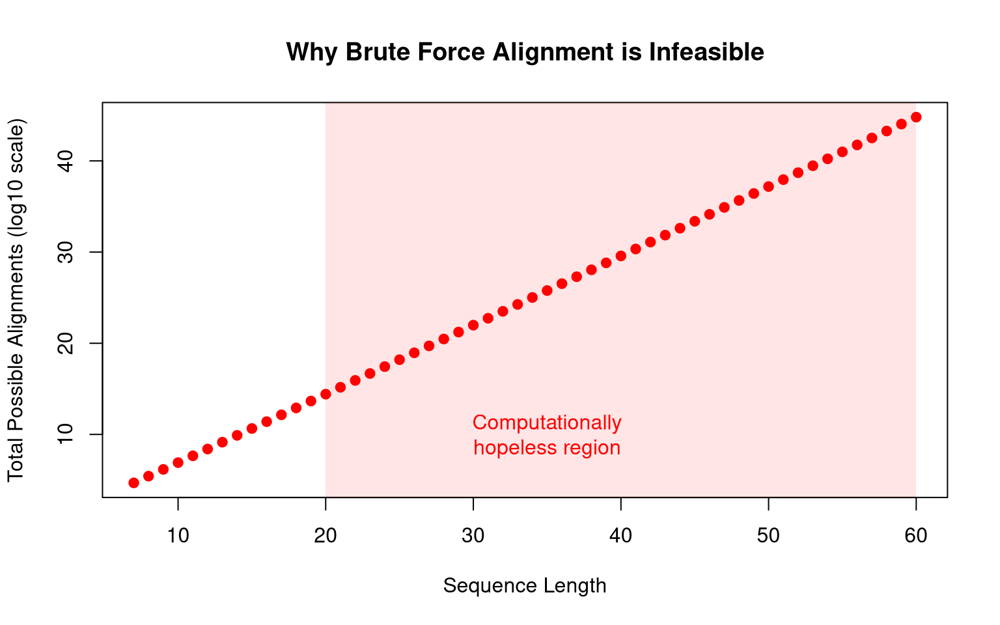

One of the most important thing to do in biology is to compare biological information, which mostly exist in the form of sequences. This is called sequence alignment and is of great importance as the comparison between sequences can provide important biological interpretation, such as finding evolutionary distance, predicting sequence's structure and function based on annotated sequence database, or detecting anomalies in a biological system. It is not an exageration to say that sequence alignment is the backbone of bioinformatics, the study of complex biological data. Here, I would like to explore the common techniques of sequence alignment by implementing the algorithms in R from scratch with the hope of understanding these fundamental techniques even more.
In this blog, firstly I would like to describe the need of efficient algorithm by demonstrating that the naive approach to align two sequences, that is by iterating over all possible alignment and find the best one by some scoring system, is not at all feasible in the real world as the operating cost of such method is exceedingly high. And after showing that naive approach is not feasible, I will discuss about a more efficient approach in the form of **dynamic programming**, of which the implementation of Needleman-Wunsch Algorithm is discussed.

All the codes for reproducing the results in this article can be accessed
https://github.com/karusosp/sequence-alignment-basic
# Introduction: The Basic of Sequence Alignment

Suppose we have two sequences, say both have the length of 6; the first sequence is "ACGTAG" and the second sequnce is "ACATAC". What is the most obvious way to compare those two sequences? One may think that the way to do it is by stacking both sequences and try to give some form of evaluation to it, that is by quantifying how similar are those sequences.

    ACGTAG
    || ||
    ACATAC

In this case we have four similar matched words (or nucleotides) and two mismatchs. One of the most obvious way to evaluate the alignment is by providing scoring system. For example, for each match a score of +1 will be added whereas mismatch will give a score of -1. In biological sequence, the mismatch usually could be interpreted as mutation event in the form of *substitution* where one nucleotide is substituted with another kind of nucleotide. Therefore the above alignment is having a score \(4-2=2\). This is straightforward enough. But there's still problem. Suppose if we use the same scoring system, what if the sequences are best aligned in different way? For instance we have two sequences: "ACGTAG" and "TACGTC". If we do the same as the above, we get the following alignment where nothing is matched at all.

    ACGTAG
          
    TACGTC

In this case, the alignment give a score of -12. But if we take a look at both sequences, a different alignment where we shift one of the sequence to the left or right will give us better alignment score:

    -ACGTAG
     ||||
    TACGTC-

Here we have four matchs and four mismatchs, that give us a score of \(4 + (-4) = 0\), which is higher than the previous one. However, in doing so we introduce something new: a *gap* which is denoted by the dashed symbol. And this actually made a biological sense because sequences organism are subject to *insertion* and *deletion* and gap is the representation of it. Therefore, our previous scoring system can be updated to provide gap penalty which in our case is given arbitrarily, where each gap would give score of -1. Once we introduce gap to the alignment, there will be complexity because we can add gap to every possible position on the both sequences.

For example if we try to align two sequences, both with the length of just 2: "AT" and "GA"; we have these possible alignment:

    alignment: AT | -AT | -AT | A-T | A-T | AT- | AT- | 
               GA | GA- | G-A | GA- | -GA | G-A | -GA |
    score    : -2 | -1  | -3  | -3  | -3  | -3  | -3  |

    alignment: --AT | -A-T | -AT- | A--T | A-T- | AT-- |
               GA-- | G-A- | G--A | -GA- | -G-A | --GA |
    score    :  -4  |  -4  |  -4  |  -4  |  -4  |  -4  |

For each alignment, we use the previous scoring system and find the best alignment. In this case the best alignment is the one with \(-1\) score. Thus, using a scoring system that capture match, mistmatch, and gap information, we could implement a form of algorithm in a computer machine. This is called *naive approach* to the alignment problem because we try to naively brute-force every possible alignment and find the best one

## Implementing Naive Approach Algorithm in R

Here, I try to implement the brute-force approach of sequence alignment in R. The basic algorithm for the naive approach algorithm is given as follow:

1.  CONSTRUCT matrix representation for the two sequences that will be aligned
2.  GENERATE all the possible alignment recursively
3.  SCORE each of the alignment
4.  RETURN the alignment with the best score

Those are easy enough to understand, but try to be careful with the recursive programming part as it is the one which somewhat harder to understand, at least for me. I have constructed the R script that follow that algorithm's logic faithfully which you can see at [my github repo](https://github.com/karusosp/sequence-alignment-basic).

For example, suppose we have two sequences, each has the length of just 5: "ATCAG" and "GATCA". If I run my `naive_algorithm()` function, I will get the following:

<details class="code-fold">
<summary>Code</summary>

``` r
source("scripts/naive_alignment.R")
seq1 = "ATCAG"
seq2 = "GATCA"
naive_alignment(seq1, seq2, 
                match_score = 1,
                mismatch_score = -1,
                gap_score = -1)
```

</details>

    Total number of possible alignments: 1683 

    BEST ALIGNMENT(S) with score: 2 
    -ATCAG 
    GATCA- 

As you can see from the result, the function iterate over all possible alignments and the total possibility is \(1683\) when the sequence is just 5 characters length. What if the length were higher then? Well, I would not recommend you try to run my script beyond 6 character length. The operation cost is too high and you can imagine how impractical if it is used in the real world scenario where most biological sequences have the length of more than one hundred. In fact, I would demonstrate the amount of all possible alignment for two 100-character long sequences. The formula for doing so is given by Delannoy Number:

$$
D(m, n) = \sum_{k=0}^{\min(m,n)} {m \choose k} {n \choose k} 2^k
$$

Where \(m\) and \(n\) is the amount of first and second sequence, whereas \(k\) denote the amount of non-gap in each alignment (for further understanding, read [wikipedia page for Delannoy Number](https://en.wikipedia.org/wiki/Delannoy_number)). And if we implement that formula in an R code, we get the following:

<details class="code-fold">
<summary>Code</summary>

``` r
delannoy <- function(m, n) {
  k <- 0:min(m, n)
  sum(choose(m, k) * choose(n, k) * 2^k)
}

delannoy(100, 100)  
```

</details>

    [1] 2.053717e+75

You see that just with two 100-character long sequences, we almost reach **the eddington number** (approximately \(1.57 \times 10^{79}\)), a number that represent **the total amount of all atom in the universe!**. We could also illustrate it by creating a graph where the number of possibility increase on logarithmic scale, where as you can see in the below graph, 20-long sequence already contain more than \(10^{10}\) possible alignments, which is already computationally hopeless.



# Smarter Approach: Introduction to Dynamic Programming

As we've discussed earlier, the naive approach to sequence alignment cannot work in real life precisely because it need to run for all possible alignment. A different method to find the best alignment therefore is needed to ensure optimal running time and efficient computational cost. The way to do this is by a programming technique called **dynamic programming**, which refer to a class of computing technique where a large and complex problem is broken down into simpler and overlapping sub-problems. But how exactly does this technique is being applied in the context of sequence alignment?

In order to understand, let's firslty clarify our main problem in alignment before. As we've discussed, the sequence alignment can be represented as a two-dimensional matrix. The main problem is how to find the best possible path from the START position, denoted as (1,1) in R, to the END position, denoted as (nrow, ncol). And here the best path is determined by a scoring system that is being applied to the all possible resulting alignment.

The key insight is instead of applying the scoring for each alignment, **the score can be immediately determined for each cell within the matrix based on a recurring simple question**: *what is the maximum score for this cell given three possible moves: diagonal (match = +1/mismatch = -1), downward and rightward (gap = -1)?*. And that question is being repetitively asked for every cell within the matrix. And this is much simpler problem than determining all the possible path from the start to end position. If that is a bit too abstract, let's try to imagine it.


And as you can see in the image above, the recurring problem are highlighted with red boxes. And after all the cells within the matrix are filled with the best score, we can find the best alignment by tracing back the path it require to get to the bottom-right cell and this is a trivial matter because we can directly store the move that correspond with the best score during the matrix filling process.

Why this works? The justification for this approach is the fact that for an optimal sequence alignment, the subsequence alignment also needed to be optimal as well. Therefore we can built from the ground up, from the smallest possible subsequence alignment and reuse the solution to gradually built up the full sequence alignment. And this made sense because if the subsequence alignment is unoptimal, then the whole sequence alignment is not the most optimal.

By using this dynamic programming technique, we reduce the scale problem from having to calculate the whole possibility which increase exponentially (approximately \(2^{m + n}\), to a process where the scale only increase polynomially (approximately \(m \times n\).

## Needleman-Wuncsh Algorithm (Global Alignment)

One of the gold standard in sequence alignment that uses dynamic programming is the Needleman-Wuncsh algorithm. The core logic of the algorithm can be described in few steps:

1.  GENERATE the 2D matrix representation of the sequence alignment
2.  FILL each interior cell with the maximum score from three possible moves: diagonal (match/mismatch), downward (gap), rightward (gap) and simultaneously record which move produced the best score in a pointer matrix.
3.  TRACEBACK from (nrow, ncol) to (1, 1) by following the pointer matrix, and directly build the two aligned sequences.

For demosntration purpose, I have implemented the algorithm in R which you can directly access within this github repo: [sequence-alignment-basic](https://github.com/karusosp/sequence-alignment-basic). And below is the result of aligning two 50-character long sequences using the script.

<details class="code-fold">
<summary>Code</summary>

``` r
source("scripts/needleman-wunsch.R")
seq1 <- "TCTTCACCACCATGGAGAAGGCGATACTGGATACATACATAGCATACATA"
seq2 <- "TATACGGCCATGGCATAGATTCGATCATGTACACAATGACATAGACAGTG"
result <- needleman_wunsch(seq1, seq2)
cat(" Seq1  :", result$align1, "(Seq Length ", nchar(seq1), ")", "\n",
    "Seq2  :", result$align2, "(Seq Length ", nchar(seq2), ")", "\n",
    "Score :", result$score )
```

</details>

     Seq1  : TCTTCACCACCATGG-AGA-AGGCGATAC-TGGATAC-AT-ACATAGCATACA-TA (Seq Length  50 ) 
     Seq2  : T-AT-ACGGCCATGGCATAGATTCGAT-CATGTACACAATGACATAG---ACAGTG (Seq Length  50 ) 
     Score : 14

As you can see, the algorithm works wonder, even despite my bad code implementation. It can run for over 500bp sequence without problems. In fact, with much better code implementation it can handle up to thousands sequence. The fact that it is working very fast and with reliable result made this technique a gold standard in sequence alignment. However, it must be noted that this algorithm can only be applied as pairwise-alignment (two sequences only) and global-alignment (it align the whole sequence). Different cases of alignment, for instance multiple sequence alignment or local alignment between unequal-sized sequences, need different algorithms.

# Global vs Local Alignment 
We’ve discussed about the need of optimal method to find the best alignment given two sequence with roughly similar size.
However, there are one thing that is not yet covered. 
The Needleman-Wunsch algorithm that we’ve talked about earlier is aligning two sequences end-to-end, that is it align from the first nucleotide to the last one.
Such algorithm is called **global alignment** and using that algorithm is very much appropriate for the case where we have two sequences with roughly similar length. 
An example might be when you have two sequences that encode similar gene but came from different organism, and you want to compare those two sequence and find how similar are those sequences to each other. 
Though such a case is important, there is also a case when you have sequence(s) and you want to know what the heck is those sequences are. 
In this case, using Needleman-Wunsch algorithm is not appropriate In the case when we want to align two sequences with unequal length, what we
should do is use **local alignment**. 

## Smith-Waterman Algorithm
Smith-Waterman Algorithm (SWA) actually has a lot of similarities with the Needleman-Wunsch because SWA was derived from it. Between the two, the main difference is the SWA set all the cell with negative score to zero and the traceback procedure start at the highest scoring matrix cell and finish when the traceback encounter zero-valued cell. It is this modification that allow for the algorithm to search through the database a subsequence that has the highest similarity score. The algorithm, like the Needleman-Wunschman is also guaranteed to find the most optimal alignment between two sequences.

The SWA procedure can be summarized into these steps: 
1. CREATE THE MATRIX as a representation of each sequence being aligned
2. SCORE THE MATRIX’S CELLS in similar fashion to what NWA does
3. FILL THE ZEROS for all cells that have negative score
4. TRACEBACK procedure start by finding cell with the highest score and walk the optimal path until it encounter zero-valued cell
5. RETURN THE SEQUENCE AND SCORE based on the optimal path 

I've also implemented the algorithm in R and using the script that I've written
we can try to align two sequences with unequal sizes. 


<details class="code-fold">
<summary>Code</summary>

``` r
source("scripts/smith-waterman.R")
seq1 <- "ACACAGACAGACATGACAGACATAGAGACAGACAGAGACAGAGGGCCAGAGTTTT"
seq2 <- "AGGTTTAC"
result <- smith_waterman(seq1, seq2)
cat(" Seq1  :", result$align1, "(Seq Length ", nchar(seq1), ")", "\n",
    "Seq2  :", result$align2, "(Seq Length ", nchar(seq2), ")", "\n",
    "Score :", result$score )
```
</details>

     Seq1  : ACACAGACAGACATGACAGACATAGAGACAGACAGAGACAGAGGGCCAGAGTTTT    (Seq Length 45) 
     Seq2  :                                                 AGGTTTAC  (Seq Length  10) 
     Score : 0

As you can see from the result above, the local alignment of SWA algorithm only
align to a specific region that provide highest similarity score. As such, it is
appropriate to apply this algorithm for database search. 
# Conclusion
In this article, I've explained what sequence alignment is, why it is important, and demonstrated the need of efficient solution in the form of dynamic programming. 
This is the absolute basic of sequence alignment or sequence analysis in general and there are lot area to explore.
However, the understanding of basic mechanism of the algorithm of sequence is
very important for learning bioiformatics, especially for non-technical biologists that are the user of such kind of tools. 
The user of scientific tools must not only use the tool appropriately according to the
manual, but also need to understand the underlying mechanism so as not to
confuse themselves. It is my hope that this article will provide some kind of
enlightnment for the reader. If you find something confusing to my explanation
or the code I implement, feel free to contact me.

In the future article, I will try to discuss more about what tools that are
available for researcher in the context of sequence alignment and how to use it
to generate biological insight. 

